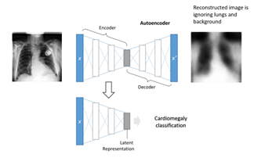

# Interpretable Self-supervised Learning for Detection of Cardiomegaly from Chest X-Ray Images 

### Background: 
Pattern recognition of different diseases from medical imaging studies using deep learning is evolving rapidly, with some algorithms performing better than expert radiologists in identifying these diseases. One area where deep learning algorithms could improve clinical workflows in a variety of medical settings is in automated cardiomegaly detection from chest X-ray images. Biomedical datasets are highly imbalanced with only few images for diseased patients and wide number of images for healthy subjects. To overcome this limitation, we developed three self-supervised approaches. A wide number of Model Interpretability approaches were used to develop trust in the deep learning model. 

# Table Of Contents
-  [Training strategies](#Training-strategies)
-  [How to run the code](#How-to-run)
-  [Code structure](#Code-structure)
-  [Manuscript](#Manuscript)
-  [Requirements](#Requirements)
-  [How to cite](#How-to-cite)

# Training strategies

Detailed description of training can be seen in the manuscript. Self supervised training approaches used included proxy tasks of age and sex and image reconstruction tasks. 

