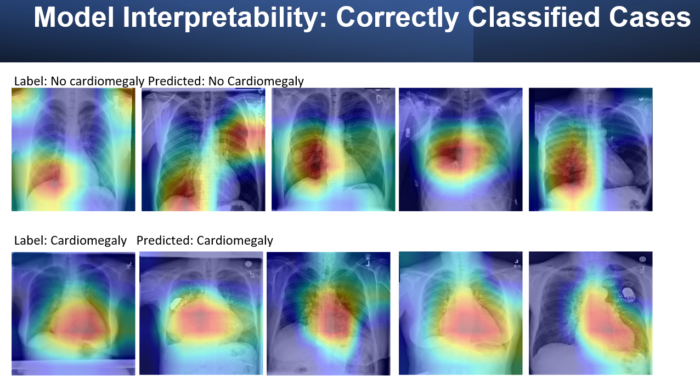

# Interpretable Self-supervised Learning for Detection of Cardiomegaly from Chest X-Ray Images

### Background:

Pattern recognition of different diseases from medical imaging studies using deep learning is evolving rapidly, with some algorithms performing better than expert radiologists in identifying these diseases. One area where deep learning algorithms could improve clinical workflows in a variety of medical settings is in automated cardiomegaly detection from chest X-ray images. Biomedical datasets are highly imbalanced with only few images for diseased patients and wide number of images for healthy subjects. To overcome this limitation, we developed three self-supervised approaches. A wide number of Model Interpretability approaches were used to develop trust in the deep learning model.

<hr />

# Table Of Contents

- [Training strategies](#Training-strategies)
- [Interpretation](#Interpretation)
- [Code structure](#Code-structure)
- [Manuscript](#Manuscript)
- [Requirements](#Requirements)
- [How to cite](#How-to-cite)

<hr />

# Training strategies

Detailed description of training can be seen in the manuscript. Self supervised training approaches used included proxy tasks of age and sex and image reconstruction tasks.

Self supervised approach


Unsupervised approach


Learning rate optimization


# Interpretation

Interpretation of deep learning models generally considered as blackbox is vital for biomedical problems.




# <hr />

# Code structure

Four directories:

- Proxy task of age: proxy_task_age
- Proxy task of gender: proxy_task_gender
- Unsupervised learning: code_unsupervised
- Interpretation: xai

```
├──  configs
│    └── config.py - change data/logging/checkpoint paths, experiment name, gpu, training options, hyperparameters
│
├──  data
│    └── dataset_x.py - dataset class for custom dataset.
│
├──  engine - The training function to be used in the training files.
│   ├── engine_x.py  - Main training loop
│
├── train - Main training file
│   └── train.bash - Main training file
│   └── inference.bash - Main finetuning file
│   └── test_report_x.py - Generates report with various metrics.
│
│──xai - files for interpretation
│   └── viz.py - Main file
    └── supporting files similar to main training files


For training metrics, automatic generation of csv reports and tensorboard log files.

```

<hr />

# Requirements

The `requirements.txt` file contains all Python libraries and they will be installed using:

```
pip install -r requirements.txt
```

```
albumentations==1.1.0
imageio==2.11.1
joblib==1.1.0
matplotlib==3.5.0
monai==0.7.0
opencv-python-headless==4.5.4.60
pandas==1.3.4
Pillow==8.4.0
pytorch-lightning==1.5.0
scikit-image==0.18.3
scikit-learn==1.0.1
scipy==1.7.2
tensorboard==2.7.0
tensorboard-data-server==0.6.1
tensorboard-plugin-wit==1.8.0
torch==1.10.0
torchaudio==0.10.0
torchmetrics==0.6.0
torchvision==0.11.1
```

<hr />

# Manuscript

[Manuscript]('files/Cardiomegaly_detector.pdf') is a research work in progress and should not be used without prior permission.

<hr />

# How to cite

This repository is a research work in progress and should not be used without prior permission. Please contact author (drpatelkhush@gmail.com) for details on reuse of code.
